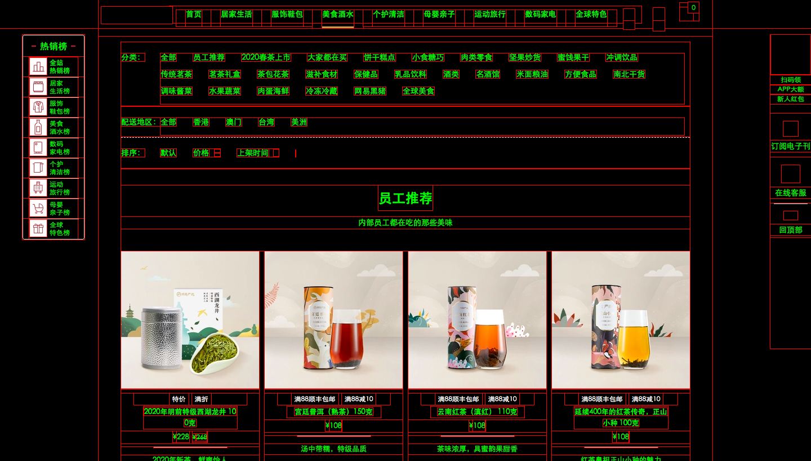

### x-ray
爬虫幽灵。此脚本的作用是可以去除冗余信息，在请求中使用selector方法时可以较高效率地对层次结构进行分辨与选择。
此脚本的导入有一些问题，与讲解过程中的代码进行了核对，确认一致，但是在油猴插件中添加脚本的时候显示错误。具体是在第11行中，显示错误原因为
`‘i' is already defined.`
但是将其“i”改为其他元素之后，保存时显示脚本无效。

```js
javascript: (
    function () {
        var elements = document.body.getElementsByTagName("*");
        var items = [];
        for (var i =0; i < elements.length; i++){
            if (elements[i].innerHTML.indexOf("background:#000!important;color:#0f0!important;outline:solid #f00 1px!important;") !=-1){
        items.push(elements[i]);
            }
        }
        if (items.length > 0) {
            for (var i = 0; i < items.length; i++){
                document.body.removeChild(items[i]);
            }
        } else {
            document.body.innerHTML += "<style>*{background:#000!important; color:#0f0!important; outline:solid #f00 1px!important;}</style>";
        }
    }
)();
```
此代码在"检查页面 -> Console“页面可执行。具体方法是：复制 -> 粘贴 -> Enter键 即可。具体效果如下：

